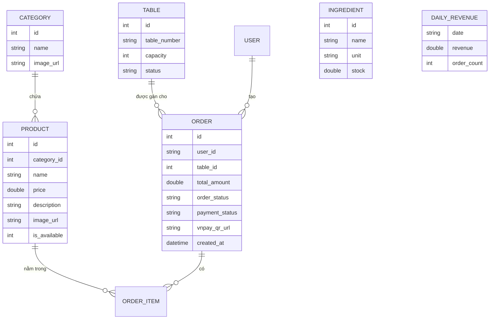

# Báo Cáo Kỹ Thuật: Hệ Thống Quản Lý Nhà Hàng Thông Minh

Báo cáo này cung cấp cái nhìn chi tiết về kiến trúc, chức năng và cơ cấu dữ liệu của ứng dụng quản lý nhà hàng, tích hợp trí tuệ nhân tạo (Gemini AI) và thanh toán điện tử (VNPAY).

---

## 1. Kiến trúc & Công nghệ sử dụng
- Ngôn ngữ lập trình: Kotlin (Android Native).
- Giao diện người dùng: Jetpack Compose (Material Design 3).
- Quản lý dữ liệu: Google Cloud Firestore (Cơ sở dữ liệu NoSQL Realtime).
- Lưu trữ tệp: Firebase Storage (Lưu trữ ảnh thực đơn).
- Trí tuệ nhân tạo: Gemini AI thông qua Vertex AI (Cung cấp chức năng trợ lý ảo tư vấn món ăn).
- Thanh toán: Tích hợp cổng thanh toán VNPAY (QR Code).

---

## 2. Sơ đồ Use Case (UC)

Sơ đồ sau đây mô tả các tương tác của 3 nhóm người dùng chính với hệ thống:


```mermaid
useCaseDiagram
    actor "Admin (Quản lý)" as admin
    actor "Kitchen (Nhà bếp)" as kitchen
    actor "Customer (Khách hàng)" as customer

    package "Quản lý Bàn & Thực đơn" {
        usecase "Thêm/Sửa/Xóa Bàn" as UC1
        usecase "Quản lý Món ăn & Danh mục" as UC2
        usecase "Xem/Đồng bộ Doanh thu" as UC3
    }

    package "Quản lý Kho & Đơn hàng" {
        usecase "Duyệt đơn hàng" as UC4
        usecase "Xác nhận hoàn thành món" as UC5
        usecase "Quản lý kho nguyên liệu" as UC6
        usecase "Nhận cảnh báo tồn kho thấp" as UC7
    }

    package "Khách hàng & Trải nghiệm" {
        usecase "Xem thực đơn & Tìm kiếm" as UC8
        usecase "Đặt món (Cart & Order)" as UC9
        usecase "Tư vấn món ăn (AI Chatbot)" as UC10
        usecase "Thanh toán QR VNPAY" as UC11
    }

    admin --> UC1
    admin --> UC2
    admin --> UC3

    kitchen --> UC4
    kitchen --> UC5
    kitchen --> UC6
    kitchen --> UC7

    customer --> UC8
    customer --> UC9
    customer --> UC10
    customer --> UC11
```

---

## 3. Sơ đồ Thực thể - Mối quan hệ (ERD)

Mô tả cấu trúc dữ liệu lưu trữ tại Cloud Firestore:




---

## 4. Mô tả chi tiết quy trình nghiệp vụ

### 4.1. Quy trình Đặt món & Xử lý (End-to-End)
1. Khách hàng: Chọn món từ màn hình `CustomerDashboardScreen`, thêm vào giỏ hàng (`Cart`) và nhấn "Gửi bếp".
2. Hệ thống: Tạo bản ghi `Order` mới trên Firestore với trạng thái `pending`.
3. Nhà bếp: Nhận thông báo realtime tại `KitchenDashboardScreen`. Nhân viên bếp nhấn "Duyệt đơn" (chuyển trạng thái sang `processing`).
4. Nhà bếp: Sau khi nấu xong, nhân viên nhấn "Hoàn thành" (chuyển trạng thái sang `completed`).
5. Thanh toán: Nhân viên (Admin) nhấn "Checkout" để giải phóng bàn và kết thúc phiên đặt món.

### 4.2. Quy trình Thanh toán VNPAY (QR Code)
- Hệ thống hỗ trợ thanh toán không dùng tiền mặt. Khi khách hàng có nhu cầu thanh toán, hệ thống sẽ tạo một liên kết VNPAY.
- Tính năng chuyển tiếp: Nhân viên tạo yêu cầu thanh toán trên thiết bị của mình, URL QR được lưu vào trường `vnpay_qr_url` trong Order.
- Khách hàng: Màn hình của khách hàng sẽ tự động lắng nghe thay đổi của Order, phát hiện có URL thanh toán và hiển thị QR Code để khách hàng quét qua ứng dụng ngân hàng.

### 4.3. Trợ lý ảo AI Chatbot (Gemini)
- Tích hợp mô hình `Gemini-2.5-Flash` để hỗ trợ khách hàng.
- Cơ chế hoạt động: Hệ thống nạp danh sách thực đơn hiện có (tên món, giá, mô tả) làm ngữ cảnh (Context) cho mô hình AI.
- Tư vấn: Khi khách hàng hỏi (VD: "Mình muốn món gì nóng và cay?"), AI sẽ lọc các món trong danh sách thực tế và tư vấn dựa trên thông tin thực đơn đang bán, giúp tăng trải nghiệm người dùng và tỷ lệ chốt đơn.

### 4.4. Quản lý Kho nguyên liệu (Ingredient Inventory)
- Hệ thống theo dõi tồn kho theo đơn vị tính chi tiết.
- Mỗi khi nguyên liệu sắp hết (`stock < 5`), hệ thống tự động đổi màu hiển thị sang đỏ kèm icon cảnh báo `Warning` để nhân viên kịp thời nhập kho, đảm bảo không bị gián đoạn phục vụ.

---

## 5. Kết luận
Hệ thống không chỉ là một ứng dụng quản lý nhà hàng thông thường mà còn là một bộ giải pháp công nghệ hiện đại. Việc tích hợp AI Chatbot và VNPAY giúp tối ưu hóa quy trình phục vụ, giảm thiểu sai sót và nâng cao tính chuyên nghiệp trong mắt khách hàng.
