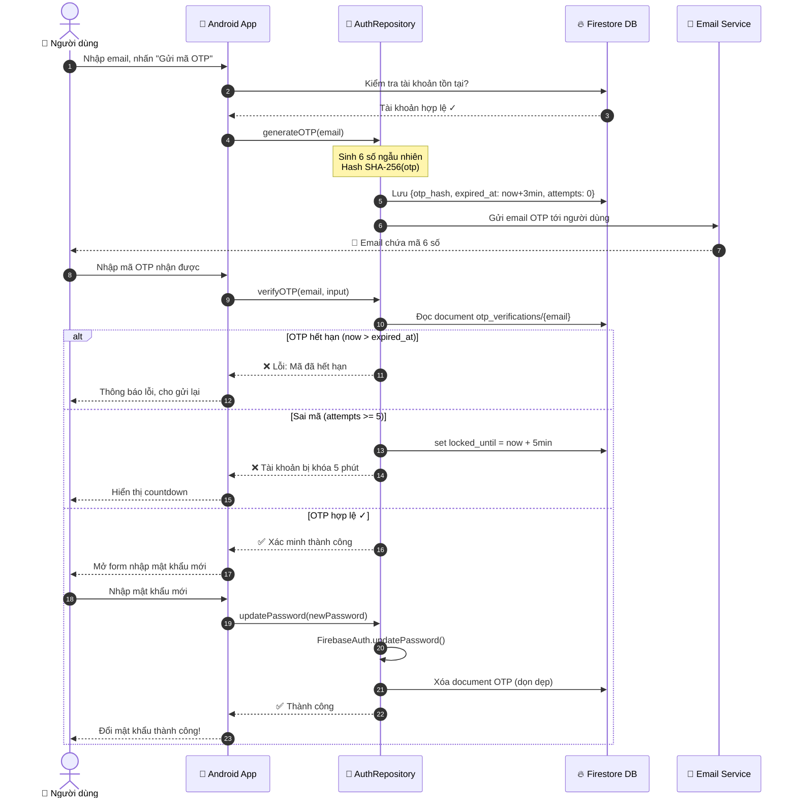
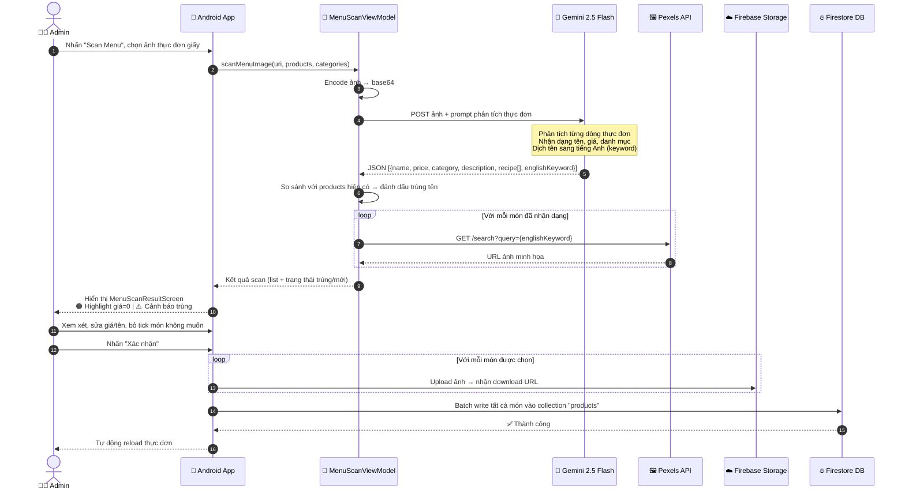
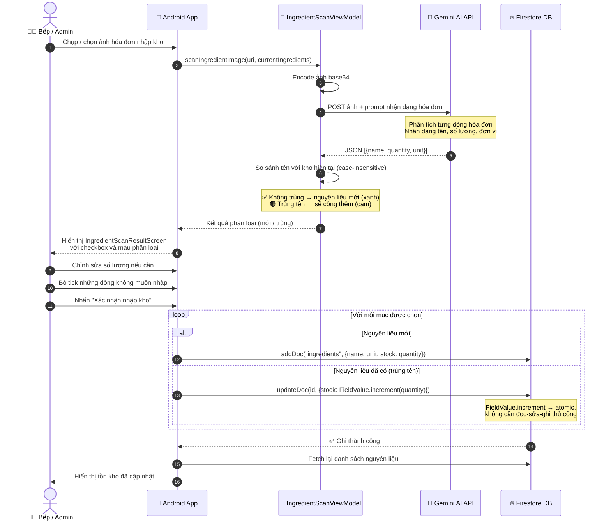
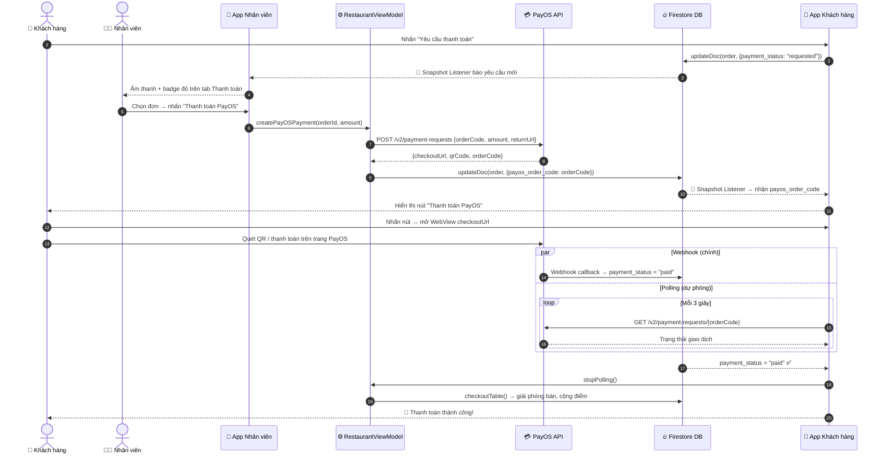
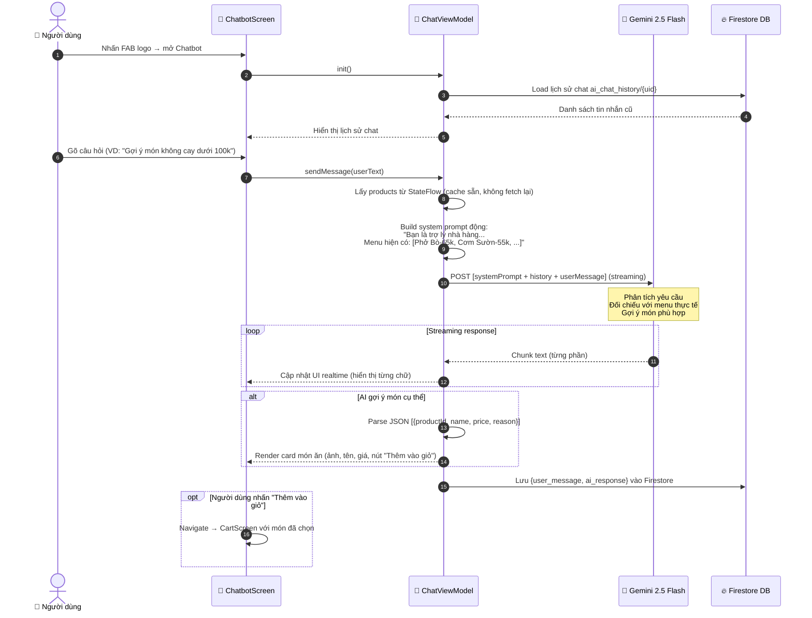
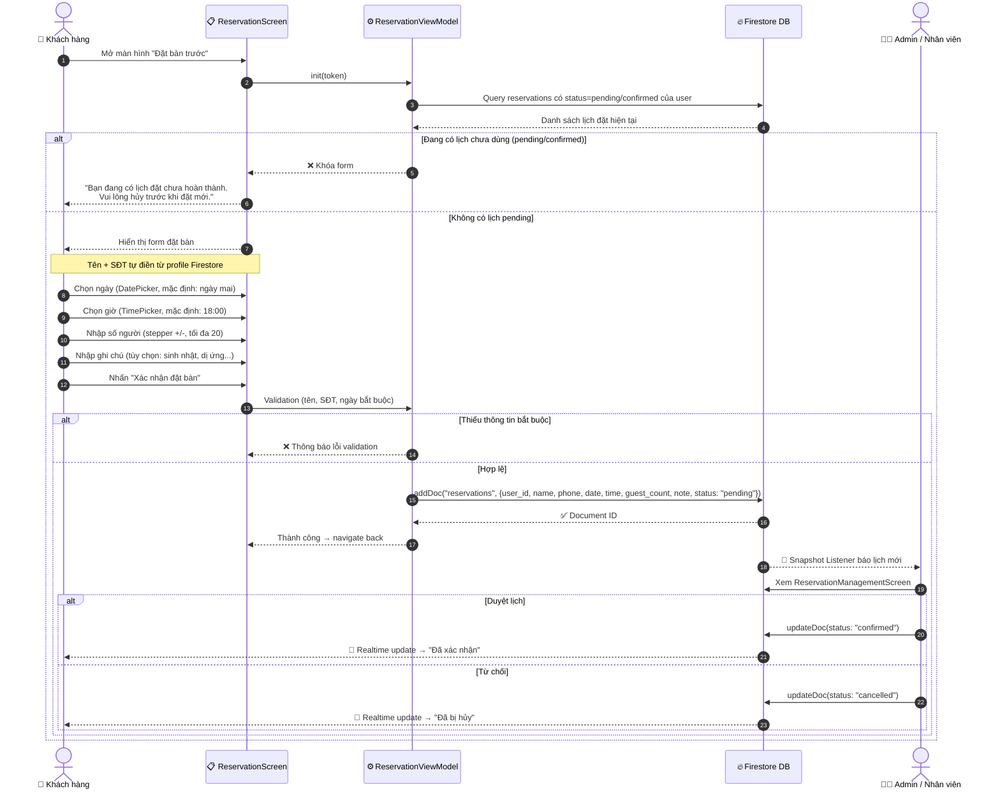
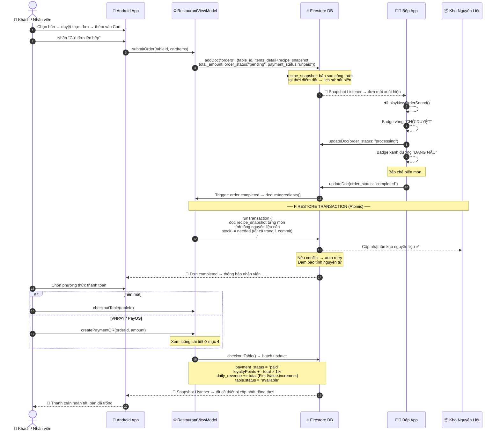
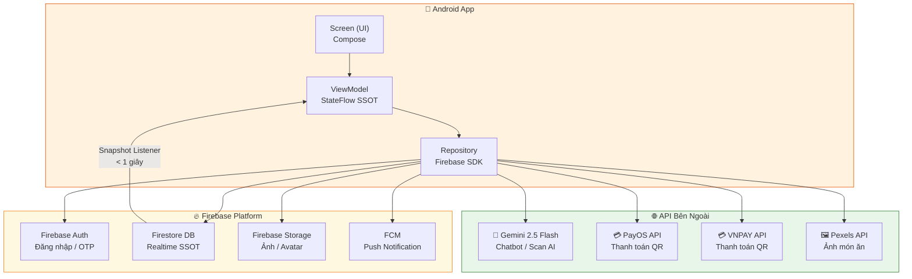

# BÁO CÁO PHÂN TÍCH LUỒNG XỬ LÝ HỆ THỐNG
## Sơ Đồ Tuần Tự (Sequence Diagram) — Các Chức Năng Nghiệp Vụ Cốt Lõi

> **Dự án:** Hệ thống Quản lý Nhà Hàng (Android - Jetpack Compose + Firebase)  
> **Mục đích:** Phân tích luồng tương tác giữa các thành phần cho 7 chức năng nghiệp vụ quan trọng nhất.

---

## 1. Đổi Mật Khẩu Qua OTP Email

### 1.1. Thành phần tham gia

| Thành phần | Vai trò |
|---|---|
| **Người dùng** | Nhập email, mã OTP, mật khẩu mới |
| **Android App** | Giao diện `ChangePasswordDialog`, xử lý input |
| **FirebaseAuthRepository** | Logic gửi OTP, xác minh, đổi mật khẩu |
| **Firestore Database** | Lưu `{otp_hash, expired_at, attempts, locked_until}` |
| **Email Service** | Gửi email chứa mã OTP 6 số |

### 1.2. Cơ chế bảo mật nổi bật
- **SHA-256 hashing**: không thể reverse-engineer mã OTP từ database
- **Rate limiting**: chờ 60 giây giữa các lần gửi lại; khóa 5 phút sau 5 lần sai liên tiếp
- **TTL 3 phút**: OTP tự vô hiệu hóa sau thời gian ngắn

---

## 2. Scan Menu Thực Đơn Bằng AI

### 2.1. Điểm kỹ thuật đặc biệt
- Gemini tự dịch tên món sang tiếng Anh để tìm kiếm ảnh Pexels phù hợp
- Phát hiện trùng tên tránh thêm món bị duplicate vào menu
- **Batch write** đảm bảo tính nhất quán (all-or-nothing cho từng lần xác nhận)

---

## 3. Scan Hóa Đơn Nhập Kho Nguyên Liệu Bằng AI

### 3.1. Điểm kỹ thuật đặc biệt
- `FieldValue.increment()` đảm bảo cập nhật nguyên liệu hiện có là **atomic** (tránh lost update khi đồng thời)
- Người dùng có thể điều chỉnh số lượng trước khi nhập → độ linh hoạt cao

---

## 4. Thanh Toán Qua Cổng PayOS

### 4.1. Cơ chế dự phòng (Polling)
> Webhook phụ thuộc vào server → nếu bị trễ/thất bại, **polling mỗi 3 giây đóng vai trò fallback** đảm bảo trải nghiệm người dùng không bị gián đoạn.

---

## 5. AI Chatbot Tư Vấn Món Ăn

### 5.1. Điểm kỹ thuật đặc biệt
- **System prompt dynamic**: AI được nạp toàn bộ menu thực tế → tư vấn chính xác giá và tên
- **Streaming response**: trải nghiệm tự nhiên, không phải đợi AI "nghĩ xong" mới hiện kết quả
- **Persistent history**: giữ ngữ cảnh cuộc trò chuyện qua Firestore, kể cả sau khi tắt app

---

## 6. Đặt Bàn Trước

---

## 7. Xử Lý Đơn Hàng End-to-End

### 7.1. Cơ chế kỹ thuật then chốt

| Cơ chế | Mục đích |
|---|---|
| `recipe_snapshot` nhúng vào Order | Bảo toàn lịch sử — công thức thay đổi không ảnh hưởng đơn cũ |
| Firestore Transaction (trừ kho) | Tránh race condition khi nhiều đơn hoàn thành cùng lúc |
| `FieldValue.increment` | Cập nhật doanh thu/điểm atomic — không cần đọc-sửa-ghi thủ công |
| Snapshot Listener | Realtime sync < 1 giây trên mọi thiết bị, không cần polling |
| StateFlow SSOT | Cache products dùng chung toàn app, giảm số lần đọc Firestore |

---

## 8. Tổng Quan Kiến Trúc Hệ Thống

---

*Báo cáo phân tích luồng xử lý — Hệ thống Quản lý Nhà Hàng*
