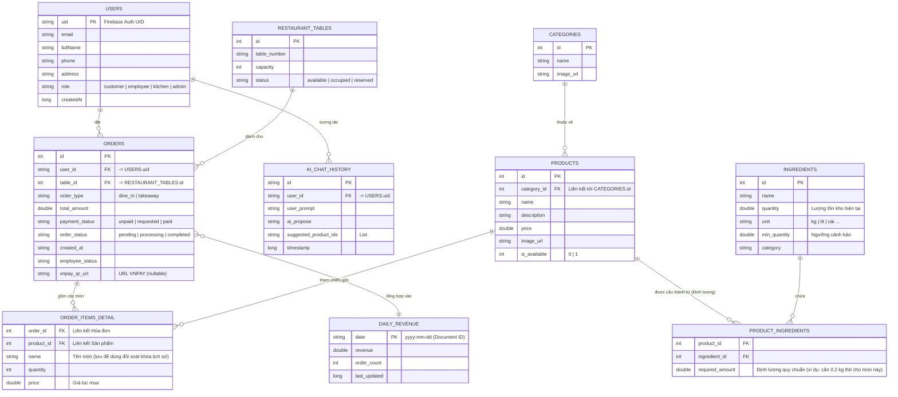

# Sơ đồ ERD Chi Tiết & Chuẩn Hóa - Hệ Thống Quản Lý Nhà Hàng

Theo nguyên tắc thiết kế dữ liệu chuẩn hóa (Tránh trùng lặp / Redundancy), hệ thống dữ liệu đã được tinh gọn lại, loại bỏ các chi tiết thừa thãi và xác lập các liên kết chặt chẽ thông qua các Khóa ngoại (Foreign Key).

## 1. Mạch logic thiết kế (Cập nhật)
Dựa theo các góp ý chuẩn hóa:
1.  Bảng `RESTAURANT_TABLES` được giữ duy nhất làm nguồn thông tin bàn cữ.
2.  Bảng `ORDER_ITEMS_DETAIL` được bổ sung `product_id` và `price` để nắm rõ mặt hàng cũng như giá lịch sử.
3.  Bảng `INGREDIENTS` đã được kết nối lại thông qua bảng cầu nối trung gian `PRODUCT_INGREDIENTS` để định lượng món ăn.
4.  Bảng `PRODUCTS` đã xóa thuộc tính `category_name` (có thể truy xuất thông qua `category_id`).
5.  Bảng `ORDERS` đã xóa `table_number` (để tránh trùng lặp dữ liệu với `RESTAURANT_TABLES`), chỉ giữ lại `table_id`.

## 2. Sơ đồ ERD (Hình ảnh và Mermaid)

### Định nghĩa qua Code (Mermaid Diagram)

---

## 3. Mô tả chi tiết các Thực thể (Entities) và Logic Vận hành

Việc chuẩn hóa cơ sở dữ liệu giúp phân tách rõ ràng trách nhiệm của từng bảng. Dưới đây là mô tả chi tiết cho từng thực thể trong hệ thống:

### 3.1. Phân hệ Định danh và Chăm sóc Khách hàng
- `USERS` (Người dùng): Trung tâm của hệ thống dữ liệu nhân sự và khách sỉ/lẻ. Bảng này phân quyền qua biến `role` (gồm: `admin`, `kitchen`, `employee`, `customer`). Trường `createdAt` dùng để thống kê tốc độ tăng trưởng khách hàng mới.
- `AI_CHAT_HISTORY` (Lịch sử Chat AI): Đóng vai trò là bộ nhớ ngữ cảnh. Khi `USERS` tương tác với hệ thống tư vấn thông minh (Gemini AI), toàn bộ prompt và phản hồi (ai_propose) đều được lưu lại kèm theo danh sách mã món ăn mà AI đã gợi ý (`suggested_product_ids`). Phục vụ phân tích mức độ hiệu quả chốt đơn và đo lường trải nghiệm.

### 3.2. Phân hệ Quản lý Thực đơn & Bàn
- `CATEGORIES` (Danh mục): Phân loại Menu (Khai vị, Món chính, Đồ uống...).
- `PRODUCTS` (Món ăn): Mỗi món ăn lưu trữ `category_id` đối chiếu trực tiếp về `CATEGORIES`. Tình trạng `is_available` cho phép Admin ẩn hoặc tạm ngưng bán nhanh chóng trên UI mà không cần xóa dữ liệu.
- `RESTAURANT_TABLES` (Bàn ăn): Bảng duy nhất độc quyền quản lý thông tin trạng thái Bàn. Nhờ việc chuẩn hóa, mỗi khi có khách lập Đơn (`ORDERS`) gắn với một bàn, `status` của bàn tự động chuyển từ `available` sang `occupied`.

### 3.3. Phân hệ Đặt hàng & Phục vụ (Core Business)
- `ORDERS` (Hóa đơn/Đơn món): Trung tâm giao tiếp giữa Giao diện Khách hàng (HOẶC Giao diện Phục vụ) với Nhà bếp.
    - Cấu trúc chặt chẽ với ID tham chiếu (chỉ giữ `table_id`).
    - Quản lý tách bạch hai tiến trình: Tiến trình Thanh toán (`unpaid` -> `requested` -> `paid`) và Tiến trình Phục vụ (`pending` -> `processing` -> `completed`). 
    - Liên kết động phương thức chuyển khoản thông qua `vnpay_qr_url`.
- `ORDER_ITEMS_DETAIL` (Chi tiết Đơn món): Cầu nối bóc tách các Line Item của Đơn. Lưu `product_id`, số lượng và đặc biệt là `price` (Giá chốt tại thời điểm mua). Điều này bảo vệ tính toàn vẹn của Báo cáo doanh thu: Tương lai nếu nhà hàng Đổi Giá trong bảng `PRODUCTS`, các Hóa đơn trong quá khứ không bị lệch số liệu.

### 3.4. Phân hệ Quản lý Kho & Định lượng Món ăn
- `INGREDIENTS` (Nguyên liệu thô): Quản lý lượng tồn kho thực tế (`quantity`). Cung cấp khả năng Cảnh báo hết hàng linh hoạt nhờ trường `min_quantity` - thiết lập một mức ngưỡng tối thiểu khác nhau cho mỗi loại mặt hàng.
- `PRODUCT_INGREDIENTS` (Định lượng món/ Recipe): _Đây là bảng Cầu Nối cốt lõi_ giải quyết bài toán Many-to-Many trong chuẩn hóa dữ liệu nhà hàng ("1 món ăn cấu tạo từ N nguyên liệu" và "1 nguyên liệu xuất hiện trong N món"). Thuộc tính `required_amount` là hệ số nhân - định mức công thức chỉ rõ bán một Món ăn sẽ tốn bao nhiêu kg/g nguyên liệu. Nhờ đó, Backend tự động cập nhật hệ thống Kho tự động trừ chuẩn xác.

### 3.5. Phân hệ Báo cáo Thống kê
- `DAILY_REVENUE` (Doanh thu và KPI ngày): Bảng "Tổng hợp mảng" (Materialized View / Aggregation table). Hệ thống không cần query hay JOIN toàn bộ lịch sử hóa đơn để cộng tiền. Cuối ngày hoặc Realtime kích hoạt cơ chế tính tổng một lần duy nhất rồi UPSERT vào bảng này. Tối ưu cực kì mạnh mẽ về tốc độ mở ứng dụng trên màn hình AdminDashboard.
